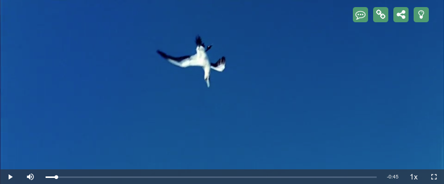

# videojs-topbar-buttons

Little plugin for [video.js][videojs] adding topbar with buttons to player area. Tested for Video.js 6.9.0.
____

## Purpose

Add topbar with custom buttons to your player area.


Right now plugin contains following buttons:
* "Toggle Light" Button - switch on and off darken blur for page behind the player.
* "Share button" - opens modal with AddToAny  set of share buttons.
* "Watch on site" button - can be used for embed player to let user be redirected to main site and see current video there.
* "Feedback" button -  opens modal with few buttons for user can send some feedback. Sending feedback is not implemented and can be done inside launchFeedback() function in button click handler 

## Relations

Code partially inspired by [videojs-socialShare plugin](https://github.com/jmccraw/videojs-socialShare/) 

Also plugin use following outer parts
* [jQuery](http://code.jquery.com/jquery-3.3.1.min.js)
* [FontAwesome 4.7](https://fontawesome.com/v4.7.0/icons/) 
* [AddToAny icons](https://www.addtoany.com/)

## Usage

Add to HEAD section CSS of Video.js and TopbarButtons plugin
```html
<link href="/media/video-js-6.9.0/video-js.css" rel="stylesheet">
<link href="/media/videojs.topbar-buttons.css" rel="stylesheet">
```

Add to bottom of BODY section JS of Video.js and TopbarButtons plugin
```html
<script src="/media/jquery-3.3.1.min.js"></script>
<script src="/media/video-js-6.9.0/video.js"></script>
<script src="/media/videojs.topbar-buttons.js" defer ></script>
<!-- If you'd like to support IE8 (for Video.js versions prior to v7) -->
<script src="/media/video-js-6.9.0/videojs-ie8.min.js"></script>
```

After add your player JS code
```html
<video id="player" class="video-js vjs-default-skin" >
    <source src="https://vjs.zencdn.net/v/oceans.mp4" type='video/mp4'>
</video>
```

And add player script with plugin 
```javascript
    var Player = videojs('player', {
        fluid: true, // adaptive
        controls: true,
        autoplay: false,
        preload: 'auto',
        poster: "http://vjs.zencdn.net/v/oceans.png",
        playbackRates: [0.5, 1, 1.5, 2],
        volume: 0.5
    },
    function(){
        var player = this;
        player.topBarButtons({
            share: {
                icon: 'fa-share-alt',
                title: 'Share'
            },
            toggleLights: {
                icon: 'fa-lightbulb-o',
                title: 'Toggle lights'
            },
            watchOnSite: {
                icon: 'fa-link',
                title: 'Watch on site',
                url: 'https://google.com'
            },
            feedback: {
                icon: 'fa-commenting-o',
                title: 'Feedback'
            }
        });
    });
```

## Known issues

* Plugin use jQuery for some parts - it needs to be fixed  
* installation process will be upworked
